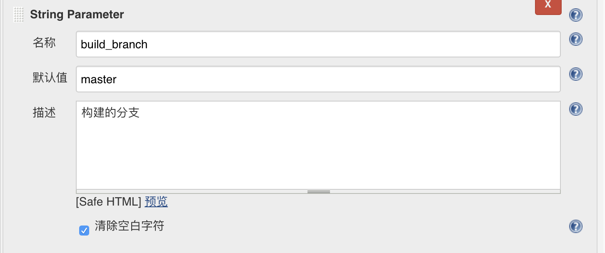

# 基于mpvue框架的微信小程序集成jenkins发布

## 1. 背景

1. 随着业务并行化程度的加重，小程序也必须同时在多个测试环境中测试，如果还像最开始那样使用微信开发工具去打码，测试与后端人员对前端人员每起一个项目，都将依赖前端小程序开发人员去打码，其人效势必越来越差。
2. 任由前端开发者开分支去测试项目，是否记得去合并master代码，将完全依赖于前端开发者，一旦忘记，必然会造成测试过程中的不充分。
3. 由开发工具上传版本时，同样由于没有关联git合并操作，可能发版后，master代码中还是不包含本次上线的内容，造成后续开发者遗漏功能。
4. 由于版本管理上的不规范，一旦上线发生问题，没有tag用以回滚，在紧急情况下无法控制项目风险。

## 2. 集成发布的优点

1. 有了集成化发布系统，后端与测试开发者，需要某个环境的小程序二维码时，只要自己去jenkins点一下发布即可，不用再依赖于前端开发者。
2. 每次测试环境打码时，都将检查当前分支是否合并过master代码。在测试合并时，将给予警告（或者直接不让打包），避免测试版本缺失master稳定版本功能。
3. 每次上线上传版本时，将自己打tag，并将分支代码合并到master。省去人工合并的麻烦、避免了忘记合并的风险。
4. 因为每次上传代码都有tag，可以轻松回到上一个版本。

## 3. 搭建步骤

### 3.1 jenkins安装

* 环境选择：由于小程序构建的命令集只支持windows/macos，参考[微信官方文档](https://developers.weixin.qq.com/miniprogram/dev/devtools/cli.html)，因此在选择环境时，不能使用常见的linux服务器，必须使用windows服务器，或自己向公司申请一台mac机器。个人建议使用服务器，因为个人电脑在公司办公网，很麻烦因断点原因失去服务，每次断电后ip可能还会发生变化，造成使用上的不便。

* 下载jenkins.war
    下载地址：https://www.jenkins.io/download/  
    找到 [Generic Java package (.war)](http://mirrors.jenkins.io/war-stable/latest/jenkins.war)  
    由于jenkins依赖java环境，因此也需要下载jdk，不再赘述。

* 启动jenkins.war

    `java -Dfile.encoding=UTF-8 -jar jenkinsnew.war`  
    注意，启动时一定要加上 `-Dfile.encoding=UTF-8` 参数，否则最后构建时将存在乱码。

### 3.2 插件安装

* GIT plugin
* SSH Credentials Plugin
* Git Changelog Plugin: 获取仓库提交的commit log
* build-name-setter：用于修改Build名称
* description setter plugin：用于在修改Build描述信息，在描述信息中增加显示QRCode（二维码）
* Post-Build Script Plug-in：在编译完成后通过执行脚本实现一些额外功能
* NodeJS:小程序构建需要，在更改提交状态时使用node技术
* AnsiColor：日志输出有颜色，脚本中有设置log格式类似：33[字符背景颜色;字符颜色m{String}33[0m  
安装方式也比较简单，直接在Jenkins的插件管理页面搜索上述插件，点击安装即可。

### 3.3 创建item

第一次创建自由风格的job即可，后续可作为模板，针对具体的项目复制该模板，修改少量配置信息，即可将这一套持续集成发版平台运行起来  

1. 创建item


2. 参数设置

    * build_type：构建环境
    
    * build_branch：构建分支  
    
    * work_plat：工作目录
    
    * app_version：小程序发版版本。发生产提审时使用  
    
    * desc：小程序发版描述。发生产提审时使用  
    
    * 构建预览  
    

3. 源码管理


4. 构建环境


5. 构建脚本

    ```shell
    set +x
    msg() {
        printf '%b\n' "$1" >&2
    }

    info()
    {
        msg "[INFO] $1"
    }

    success() {
        msg "\e[1;32m[✔] ${1}${2} \33[0m "
    }

    notice() {
        msg "\e[1;33m ${1} \e[0m"
    }

    error_exit() {
        msg "\e[1;31m[✘] ${1}${2} \33[0m"
        exit 1
    }

    exec_cmd()
    {
    echo "[执行命令] $1"
    $1
    if [ "$?" != "0" ]; then
        error_exit "命令执行失败: 错误码为 $?"
    fi
    }

    # 编译vue为小程序代码
    vue_build() 
    {
        project_home=${work_palt}"/"${JOB_NAME}
        info "开始编译"
        cd ${project_home}
        #npm install cnpm -g --registry=https://registry.npm.taobao.org
        cnpm install
        cnpm run build
        success "编译成功"
    }


    # sed匹配hosts.js内容，替换服务端环境
    change_hosts0() 
    {
        project_home=${work_palt}"/"${JOB_NAME}
        wxapp_home=${project_home}"/static"
        cd ${wxapp_home}
        if [ -f "hosts.js" ]; then
            if [[ "$build_type" =~ ^dev.* ]]; then
                target_env=$build_type
                sed -i s/^"let currEnv".*/"let currEnv=\"$build_type\""/g hosts.js
                success "static切换到 ${target_env} 环境"
            elif [[ "$build_type" == pre1 ]]; then
                target_env=$build_type
                sed -i s/^"let currEnv".*/"let currEnv=\"$build_type\""/g hosts.js
                success "static切换到 ${target_env} 环境"
            elif [[ "$build_type" == prod ]]; then
                target_env="prod"
                sed -i s/^"let currEnv".*/"let currEnv=\"$build_type\""/g hosts.js
                success "static切换到 ${target_env} 环境"
            fi
            if [ "$?" != "0" ]; then
                error_exit "切换环境失败！"
            fi
        else
            error_exit "没有找到hosts.js文件！"
        fi
    }

    # sed匹配hosts.js内容，替换服务端环境
    change_hosts1() 
    {
        project_home=${work_palt}"/"${JOB_NAME}
        wxapp_home=${project_home}"/wxApp/utils"
        cd ${wxapp_home}
        if [ -f "hosts.js" ]; then
            if [[ "$build_type" =~ ^dev.* ]]; then
                target_env=$build_type
                sed -i s/^"const CURRENT_ENV".*/"const CURRENT_ENV=\"$build_type\""/g hosts.js
                success "wxApp/utils切换到 ${target_env} 环境"
            elif [[ "$build_type" == pre1 ]]; then
                target_env=$build_type
                sed -i s/^"const CURRENT_ENV".*/"const CURRENT_ENV=\"$build_type\""/g hosts.js
                success "wxApp/utils切换到 ${target_env} 环境"
            elif [[ "$build_type" == prod ]]; then
                target_env="prod"
                sed -i s/^"const CURRENT_ENV".*/"const CURRENT_ENV=\"$build_type\""/g hosts.js
                success "wxApp/utils切换到 ${target_env} 环境"
            fi
            if [ "$?" != "0" ]; then
                error_exit "切换环境失败！"
            fi
        else
            error_exit "没有找到hosts.js文件！"
        fi
    }

    #修改appid
    change_app_id()
    {
        project_home=${work_palt}"/"${JOB_NAME}
        cd ${project_home}
        dev_app_id="wxc111111111111111"
        prod_app_id="wx2222222222222222"
        if [ -f "project.config.json" ]; then
            sed -i s/"${dev_app_id}"/"${prod_app_id}"/g project.config.json
            success "切换appId为 ${prod_app_id}"
        else
            error_exit "没有找到project.config.json文件！"
        fi
    }


    # 生成开发版二维码
    # 这里直接执行小程序cli的命令生成二维码图片并输出到工作目录下
    uplaod_for_preview()
    {
        wx_home="C:/Program Files (x86)/Tencent/微信web开发者工具"
        project_home=${work_palt}"/"${JOB_NAME}
        wxapp_home=${project_home}"/dist"
        wxapp_qr_path=$project_home"/qr_${BUILD_ID}.png"
        cd "$wx_home"
        exec_cmd "cli.bat preview --debug --project $wxapp_home -f image --qr-output $wxapp_qr_path"
        if [ ! -f ${wxapp_qr_path} ];then
            error_exit "小程序预览失败"
        fi
    }

    # 根据feature参数增加版本号，上传到微信小程序后台准备提审
    # 用node程序直接读取version.js修改版本号
    upload_for_release() 
    {
        wx_home="C:/Program Files (x86)/Tencent/微信web开发者工具"
        project_home=${work_palt}"/"${JOB_NAME}
        wxapp_home=${project_home}"/dist"
        echo "小程序提审版本号："$app_version
        echo "小程序提审版本备注："$desc
        if [ $app_version"x" == "x" ]; then
            error_exit "小程序提审版本号不能为空"
        fi
        if [ $desc"x" == "x" ]; then
            error_exit "小程序提审版本备注不能为空"
        fi
        cd "$wx_home"
        exec_cmd "cli.bat upload --project ${wxapp_home} -v $app_version -d $desc"   
    }

    # 检查主干上的提交是否已经合并至分支
    function branch_master_merged_check()
    {
        if [ ${build_branch} == "master" ]; then
            return
        fi
        if [[ ${build_branch} =~ ^tag_.* ]]; then
            return
        fi
        
        echo "检查主干上的提交是否已经合并至分支【${build_branch}】"
        tag_type=${build_branch:0:2}
        if [ $tag_type == "f_" -o ${build_branch} == "develop" ]; then
            diff_target="^origin/${build_branch}"
        else 
            error_exit "分支命名不规范。f_开头为开发分支，tag_开头为生产发版tag"
        fi
        echo "diff_target="$diff_target

        diff_log=`git log origin/master $diff_target --oneline`
        if [ -n "$diff_log" ]; then
        msg "----------------------------------------"
            info "$diff_log"
            msg "----------------------------------------"
            notice "[告警]请将主干上的更改合并至分支【${build_branch}】再执行发布"
        else
            success "已经合并"
        fi
    }

    #生产发版时打tag
    function prod_git_push_tag()
    {
        
        if [ ${build_branch} == "master" ]; then
            info "分支["$build_branch"]发版不创建tag"
            return
        fi
        
        if [[ ${build_branch} =~ ^tag_.* ]]; then
            info "分支["$build_branch"]发版不创建tag"
            return
        fi
        
        #把分支f_改为tag_前缀用来创建tag
        tag_name=`echo ${build_branch} | sed s/^f_/tag_/`
        tag_name=$tag_name"_"$(date +"%Y%m%d%H%M%S")
        
        if [[ $build_branch =~ ^f_.* ]]; then
            exec_cmd "git tag $tag_name"
            exec_cmd "git push origin $tag_name"
            success "----------------------------------------"
            success "生成tag: $tag_name"
            success "----------------------------------------"
        else
            error_exit "无效的分支【${build_branch}】，生产部署需要是tag_、f_的分支或master"
        fi
        
    }

    #合并分支到主干
    function prod_branch_merge_to_master(){
        if [ ${build_branch} == "master" ]; then
            return
        fi
        
        if [[ ${build_branch} =~ ^tag_.* ]]; then
            return
        fi
        
        if [[ ${build_branch} =~ ^f_.* ]]; then
            msg "合并分支代码到主干上.."
            exec_cmd "git checkout master	"
            exec_cmd "git pull"
            exec_cmd "git merge --no-ff origin/${build_branch}"
            exec_cmd "git push origin HEAD:master"
            success "合并分支代码到主干上成功！！"
        fi
    }

    if [[ "$build_type" =~ ^dev.* ]]; then
        info "发布开发版！"
        echo ${JOB_NAME}
        branch_master_merged_check
        change_hosts0
        change_hosts1
        vue_build
        uplaod_for_preview
        success "预览成功！请扫描二维码进入开发版！"
    elif [ "$build_type" == 'pre1' ]; then
        info "发布预发版！"
        branch_master_merged_check
        change_hosts0
        change_hosts1
        change_app_id
        vue_build
        uplaod_for_preview
        success "预览成功！请扫描二维码进入预发版！"
    elif [ "$build_type" == 'prod' ]; then
        info "准备上传！"
        branch_master_merged_check
        prod_git_push_tag
        prod_branch_merge_to_master
        change_hosts0
        change_hosts1
        change_app_id
        vue_build
        upload_for_release
        success "上传成功！请到微信小程序后台设置体验版并提交审核！"
    else
        error_exit "需要设置合法的build_type！"
    fi
    ```

    说明：切换环境是通过hosts.js实现的。由于生产和开发版本用了两个小程序，通过app_id切换生产和开发小程序

6. 构建后操作

构建完成后，需要展示小程序预览二维码，我们通过设置描述来完成。


```html
<div>打包环境：${build_type}环境</div>
<div>构建分支：${build_branch}</div>
<div>打包版本：${app_version}</div>
<div>版本描述：${desc}</div>

```

注意，默认情况下，描述中不支持html，需要在设置中打开。如：


> 总结：如上，我们建立了整套构建流程：
> 1. 摘取代码
> 2. 分支是否合并过master检查
> 3. 编译代码
> 4. 选择环境
> 5. 调用微信开发工具上传代码
> 6. 如果是生产环境合并master
> 7. 在描述中展示发布信息（包括二维码）

## 4. 使用步骤

  1. 测试环境打码  
  首先构建：
  
  然后查看发布结果：  
  
  2. 生产环境发版
  
  然后查看发布结果：  
  
  

## 5. 附  

本文主要参考了：

微信官方文档：<https://developers.weixin.qq.com/miniprogram/dev/devtools/cli.html>

每日优鲜便利购微信小程序集成 Jenkins 生成二维码发版：<https://testerhome.com/topics/14913>
