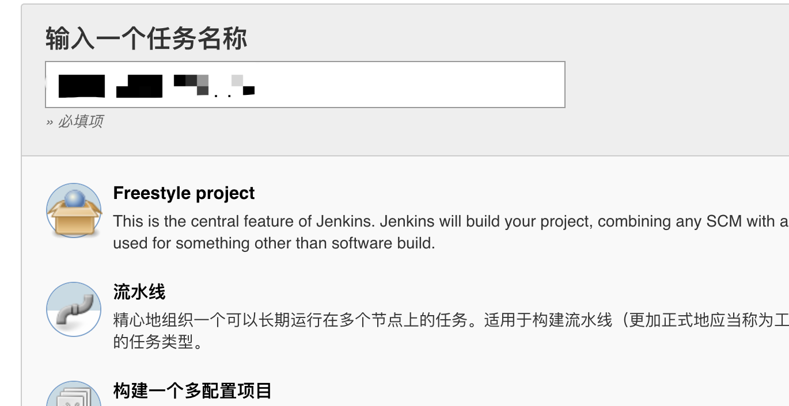

# 基于mpvue框架的微信小程序集成发布

## 1. 背景

1. 随着业务并行化程度的加重，小程序也必须同时在多个测试环境中测试，如果还像最开始那样使用微信开发工具去打码，测试与后端人员对前端人员每起一个项目，都将依赖前端小程序开发人员去打码，其人效势必越来越差。
2. 任由前端开发者开分支去测试项目，是否记得去合并master代码，将完全依赖于前端开发者，一旦忘记，必然会造成测试过程中的不充分。
3. 由开发工具上传版本时，同样由于没有关联git合并操作，可能发版后，master代码中还是不包含本次上线的内容，造成后续开发者遗漏功能。
4. 由于版本管理上的不规范，一旦上线发生问题，没有tag用以回滚，在紧急情况下无法控制项目风险。

## 2. 集成发布的优点

1. 有了集成化发布系统，后端与测试开发者，需要某个环境的小程序二维码时，只要自己去jenkins点一下发布即可，不用再依赖于前端开发者。
2. 每次测试环境打码时，都将检查当前分支是否合并过master代码。在测试合并时，将给予警告（或者直接不让打包），避免测试版本缺失master稳定版本功能。
3. 每次上线上传版本时，将自己打tag，并将分支代码合并到master。省去人工合并的麻烦、避免了忘记合并的风险。
4. 因为每次上传代码都有tag，可以轻松回到上一个版本。

## 3. 搭建步骤

### 3.1 jenkins安装

* 环境选择：由于小程序构建的命令集只支持windows/macos，参考[微信官方文档](https://developers.weixin.qq.com/miniprogram/dev/devtools/cli.html#%E8%87%AA%E5%8A%A8%E9%A2%84%E8%A7%88)，因此在选择环境时，不能使用常见的linux服务器，必须使用windows服务器，或自己向公司申请一台mac机器。个人建议使用服务器，因为个人电脑在公司办公网，很麻烦因断点原因失去服务，每次断电后ip可能还会发生变化，造成使用上的不便。

* 下载jenkins.war
    下载地址：https://www.jenkins.io/download/  
    找到 [Generic Java package (.war)](http://mirrors.jenkins.io/war-stable/latest/jenkins.war)  
    由于jenkins依赖java环境，因此也需要下载jdk，不再赘述。

* 启动jenkins.war

    `java -Dfile.encoding=UTF-8 -jar jenkinsnew.war`  
    注意，启动时一定要加上 `-Dfile.encoding=UTF-8` 参数，否则最后构建时将存在乱码。

### 3.2 插件安装

* GIT plugin
* SSH Credentials Plugin
* Git Changelog Plugin: 获取仓库提交的commit log
* build-name-setter：用于修改Build名称
* description setter plugin：用于在修改Build描述信息，在描述信息中增加显示QRCode（二维码）
* Post-Build Script Plug-in：在编译完成后通过执行脚本实现一些额外功能
* NodeJS:小程序构建需要，在更改提交状态时使用node技术
* AnsiColor：日志输出有颜色，脚本中有设置log格式类似：33[字符背景颜色;字符颜色m{String}33[0m  
安装方式也比较简单，直接在Jenkins的插件管理页面搜索上述插件，点击安装即可。

### 3.3 创建item

第一次创建自由风格的job即可，后续可作为模板，针对具体的项目复制该模板，修改少量配置信息，即可将这一套持续集成发版平台运行起来  
* 创建item

    

* 参数设置  

  * build_type：构建环境
    
  * build_branch：构建分支  
  
  * work_plat：工作目录
  
  * app_version：小程序发版版本。发生产提审时使用  
  
  * desc：小程序发版描述。发生产提审时使用  
  
  

## 4. 使用步骤

## 5. 附 

官方文档
https://developers.weixin.qq.com/miniprogram/dev/devtools/cli.html#%E8%87%AA%E5%8A%A8%E9%A2%84%E8%A7%88

引用
https://testerhome.com/topics/14913

